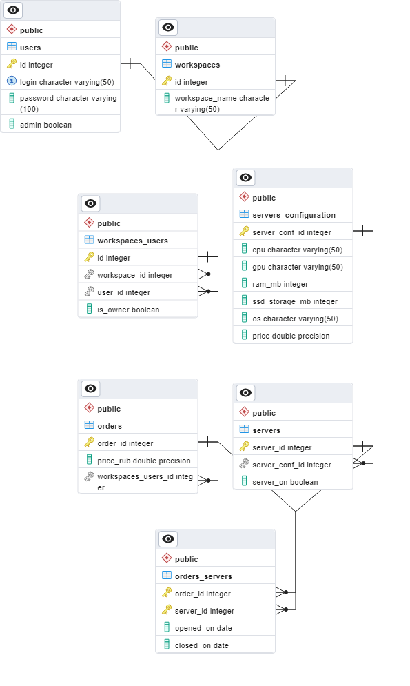

# Educational project for DB design and development course
The web app is a comprehensive project as part of a four-semester database design and development course. The project focuses on building a simple web application using Flask as the web framework and PostgreSQL as the database management system. The objective of the project is to provide hands-on experience in designing and developing a functional web application that leverages cloud hosting capabilities.

The web app serves as a practical implementation of the concepts learned throughout the course, encompassing the entire development cycle from designing the database schema to deploying the application on a cloud hosting platform.

This simple web app is partial implementation of web app for some cloud hosting company.

ERD diagram of DB:

